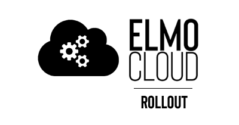
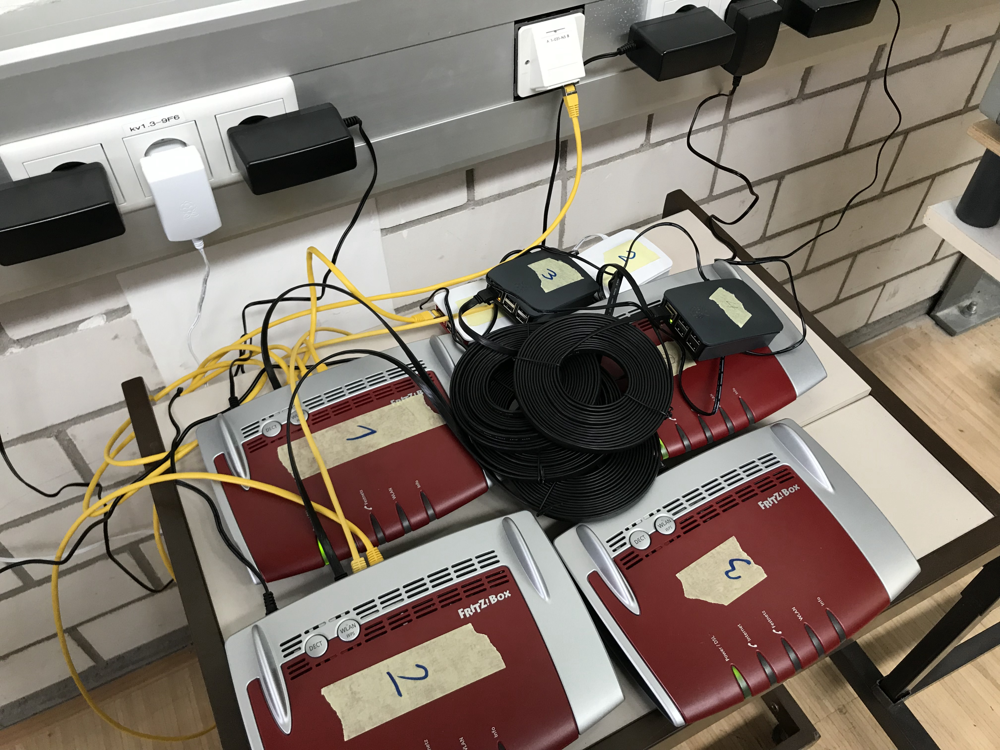

# Rollout
Das Hardware Rollout umfasst den Aufbau und Anschluss der FRITZ!Dect Steckdosen, FRITZ!Box Router und Raspberry Pi in den 3 vorhandenen Textil-Werkräumen.
Dabei wird immer ein Router mit einem Raspberry Pi zusammengeschlossen und die Steckdosen an die Stromversorgung der Nähmaschinen und Lampen angebracht.
Laut Hersteller kann ein Router maximal 10 Steckdosen verwalten.

Das Rollout wurde in 2 Phasen durchgeführt.

## Phase 1
In diesem Teil-Rollout wurden die ersten 10 Steckdosen und jeweils 1 Router und Raspberry Pi angeschlossen.

In einem wenig benutzen Nebenraum haben wir einen passenden Platz für den Router und Raspberry Pi gefunden. Anschließend mussten wir noch den Router über das Hochschulnetzwerk mit dem Internet verbinden.

Danach wurden nach und nach die 10 Steckdosen im Raum 01-31L an den Nähmaschinen und Lampen angebracht, mit dem Router verbunden und richtig benannt.

Nachdem alles erfolgreich verlaufen ist, wurde die restliche Hardware für Phase 2 bestellt.

## Phase 2
Als die neue Hardware eintraf, wurde das zweite Teil-Rollout gestartet.

Insgesamt wurden 4 weitere Steckdosen in Raum 01-31L angebracht.
Raum 01-031M erhielt 9 Steckdosen und Raum 01-031N erhielt 17 Stück.

Zusätzlich wurden 3 Router mit je einem dazugehörigen Raspberry Pi angebracht und mit dem Internet und den Steckdosen verbunden.

##

Insgesamt sind bis zum Ende des Projektes also 40 Steckdosen, 4 Router und 4 Raspberry Pi in den 3 Räumen angeschlossen worden.

Eine Erweiterung der Hardware ist jederzeit möglich, da das komplette System skalierbar ist.

## Installation der Hardware
## Konfiguration der FritzBoxen
<!--stackedit_data:
eyJoaXN0b3J5IjpbLTExOTM2MDc4MjMsLTQxNjI1Nzc3MywtMT
YzNTA0OTA4OCwtMzI1NzU3ODMxXX0=
-->