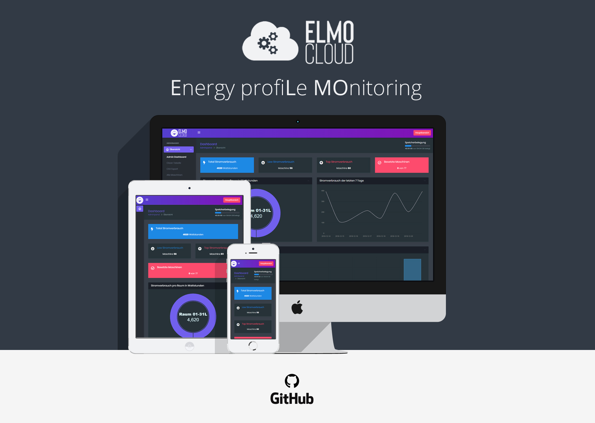

# Synopsis

ELMO ist Energiemonitoring mit COTS Hardware. Erfassungssysteme werden in einem Maschinenpark ausgebracht. Es folgt ein längerer unbeaufsichtigter Betrieb der Datenerfassung. Eine Datenauswertung macht verschiedene Betriebsbedingungen sichtbar.

**Ziele:** Reale Energieverbrauchsdaten für Forschung und Lehre an der HSRT zur Verfügung stellen. Bisher manuell erfasste Betriebsbedingungen, u.a Wartung, Auslastung, im Anwendungskontextes automatisiert erfassen können.

**Erwartete Ergebnisse:**

* System zur längerer Erfassung von Energiedaten im unbeaufsichtigter Betrieb
* Datensatz für Forschung und Lehre
* Nutzungsprofile für Anwendungen durch quantitative Auswertungen 

**Impact:** reale Verbrauchsdaten werden interfakultativ in Projekten verwendet

**Vorgehen:** Agile Planung im Team und Sprints mit messbaren Teilzielen

**Zeitraum:** Oktober 2018 - Januar 2019

## Inhalte

[ELMO GitBook](https://cdeck3r-docs.gitbook.io/elmo/)

## Teilnehmer

Dies ist Projekt im [Bachelor Wirtschaftsinformatik \(WIB\)](http://www.inf.reutlingen-university.de/studium/bachelor/wirtschaftsinformatik/) an der Hochschule Reutlingen.

**Betreuer:** Christian Decker \([@cdeck3r](https://twitter.com/cdeck3r), [@RTWIB\_Decker](https://twitter.com/rtwib_decker)\)

**Projektteam:**

* Timo Hegenberg
* Jan Schick
* Michael Strommer 
* Patrick Ardelean 
* Eda Genc 
* Justus Mattedi

## Kollaboration

* Github, Trello

<!--stackedit_data:
eyJoaXN0b3J5IjpbNzI1ODIwMTkzLC05ODgyNjAxMDcsLTEwMD
YxMDk3NSwtMTgxMDM4NTAxLC05ODg2OTE3NywtMTg2OTY4MjUx
XX0=
-->