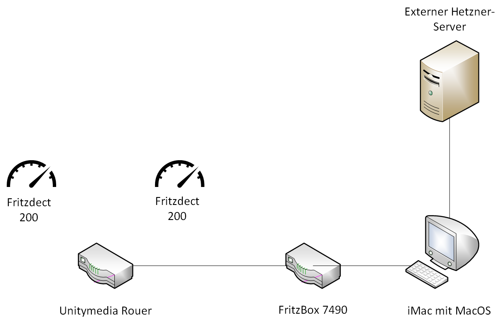

# Dokumentation

## Demo-System

### Demo-Infrastruktur

#### Ziel: Funktionierende Infrastruktur mit der Fritzbox 7490 und den Fritzdect 200 Energiesteckdosen sowie einem externen Server

#### 1 Schritt: 

#### 2 Schritt:

#### 3 Schritt

